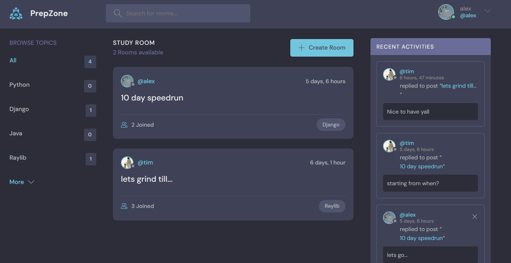
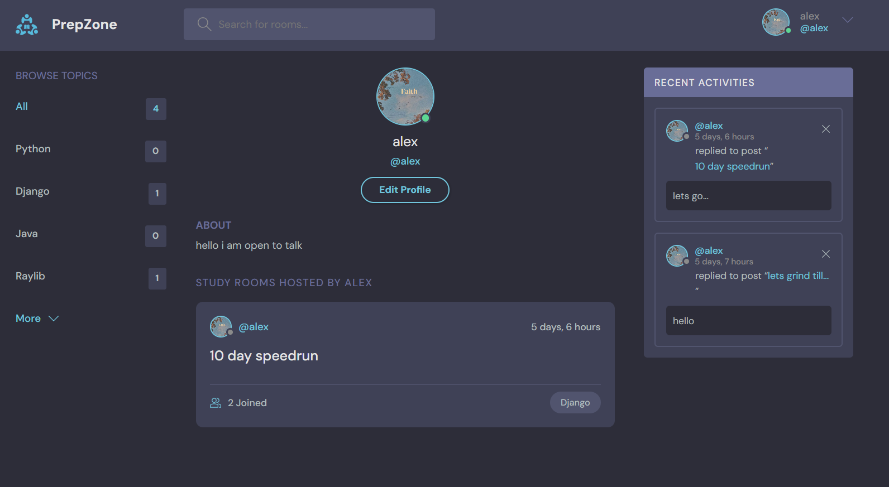

# 🧠 StudyRoom – A Collaborative Chat and Study Platform

StudyRoom is a full-stack web application built using **Django** for the backend and **HTML, CSS, JavaScript** for the frontend. It allows users to create virtual study rooms, engage in topic-based conversations, and manage their content securely and efficiently.

## 🚀 Features

- 📱 **Responsive Design**: Optimized for both mobile and desktop views.
- 👥 **User Authentication**:
  - Register, login, logout securely.
  - Users can delete their own rooms and messages.
- 🏠 **Room Management**:
  - Users can create and manage study rooms.
  - Other participants can join, interact, and leave messages.
- 💬 **Real-Time Chat**:
  - Chat within rooms.
  - View latest conversations in the **Recent Activities** section.
- 🔒 **Security**:
  - Django’s ORM is used for all DB operations – preventing SQL injection.
  - Content management permissions are enforced (users can only delete their own content).
- 🧩 **Database**:
  - Powered by SQLite.
  - Well-structured schema based on good database modeling practices.

## 🛠 Tech Stack

- **Backend**: Django (Python)
- **Frontend**: HTML, CSS, JavaScript
- **Database**: SQLite (using Django ORM)
- **Deployment**: [PythonAnywhere](https://www.pythonanywhere.com/)

## 📸 Screenshots



## 🌐 Live Demo

🔗 [Visit the live site](https://alyoexe.pythonanywhere.com/)  

## 🛠 Installation & Setup

```bash
# Clone the repository
git clone https://github.com/yourusername/studyroom.git
cd studyroom

# Create a virtual environment and activate it
python -m venv venv
source venv/bin/activate  # On Windows use `venv\Scripts\activate`

# Install dependencies
pip install -r requirements.txt

# Apply migrations and run the server
python manage.py migrate
python manage.py runserver
